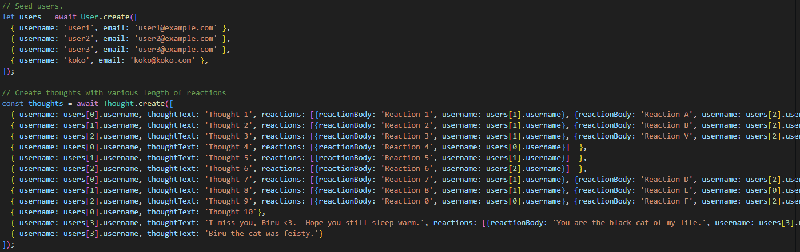
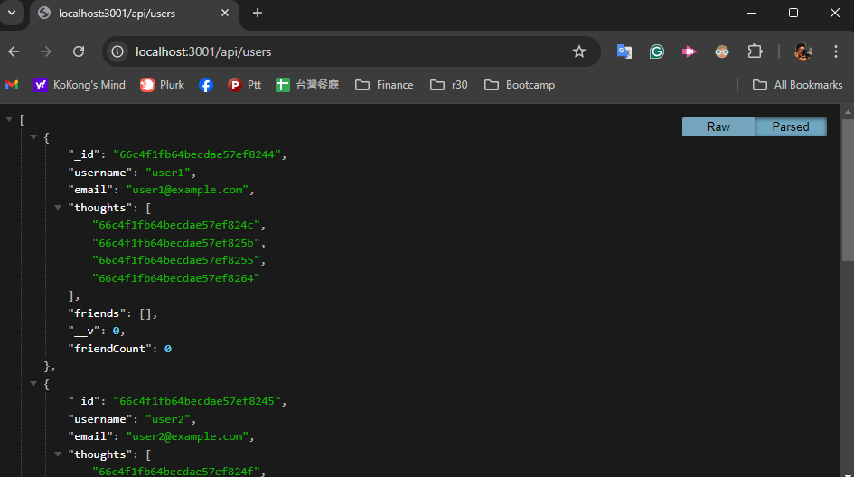
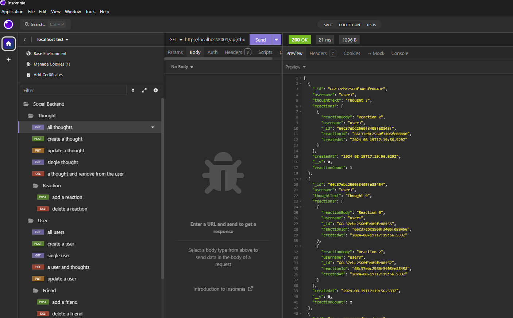

# social-network-api-MongoDB

***
## Table of content
- social-network-api-MongoDB
  - [Description](#description)
  - [Installation](#installation)
  - [Usage](#usage)
  - [Tests](#tests)
  - [Contributing](#contributing)
  - [License](#license)
  - [Questions](#Questions)
  - [Screenshot](#Screenshot)
***
## Description
A social network backend featured by express.js and MongoDB/Mongoose to implement users, friends, thoughts(as user's post) and reactions(as comments to a thought).

***
## Installation
To run this on a local machine:
- The backend requires npm and MongoDB Community Edition.  
  - [Node.js/npm installation](https://docs.npmjs.com/downloading-and-installing-node-js-and-npm)
  - [MongoDB Community Edition installation](https://www.mongodb.com/docs/manual/administration/install-community/)
1. Clone the repo: https://github.com/momokokong/social-network-api-MongoDB
2. In the terminal, move to where the cloned local repo is.
3. `npm install` to install the necessary node modules.
4. `npm run seed` to seed the database.
5. `npm run start` to start the server. 

***
## Usage
1. Given this project implements only the backend routes, use either [Insomnia](https://insomnia.rest/download) or see the JSON returns from browser directly.  See screenshots for examples.

***
## Tests
Below are the routes available to play with: 
- Users
  - uid is the user._id
  - fid is the firend's user._id
    - `/api/users`
        - GET - Get all users
        - POST - Create a user
          - JSON BODY requires the following fields: username and email
    - `/api/users/:uid`
        - GET - Get a single user
        - PUT - Update a user
          - JSON BODY requires the following fields: username and email
        - DELETE - Delete a user
    - `/api/users/:uid/friends/:fid`
        - POST - Add a friend(fid) to a user(uid)
        - DELETE - Remove a friend(fid) from a user(uid)
- Thoughts
  - thoughtId is the thought._id
  - reactionId is the reaction._id
    - `/api/thoughts`
      - GET - Get all thoughts
      - POST - Create a thought
        - JSON BODY requires the following fields: username, thoughtText
    - `/api/thoughts/:thoughtId`
      - GET - Get a single thought
      - PUT - Update a thought
        - JSON BODY requires the following fields: thoughtText
      - DELETE - Delete a thought
    - `/api/thoughts/:thoughtId/reactions/`
      - POST - Create a reaction and attach to a thought
        - JSON BODY requires the following fields: username, reactionBody
    - `/api/thoughts/:thoughtId/reactions/:reactionId`
      - DELETE - Delete a reaction from a thought

***
## Contributing
Contact me.  Find my information in the [Questions](#Questions) section.

***
## License
This project adopts WTFPL license practices. Check the website for license details: [License: WTFPL](http://www.wtfpl.net/about/)

***
## Questions
[momokokong's GitHub profile.](https://github.com/momokokong)

[Po Shin Huang Linkedin profile](https://www.linkedin.com/in/poshinhuang/)

***
## Screenshot
- Seeded data.  See utils/seed.js for details.

- Browser view of GET all users.

- Insomnia view of GET all thoughts.
